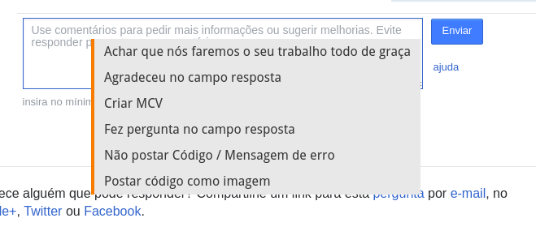

# StackoverflowPT Tampermonkey / Greasemonkey

## SOptCommentContextMenu
Aciona todos os links Comentar na pergunta, e adiciona um Menu Contextual com comentários rápidos. [<kbd>Clique aqui para instalar diretamente</kbd>][1]

[1]: https://github.com/wellmotta/SOptCommentContextMenu/blob/master/SOptCommentContextMenu.user.js
